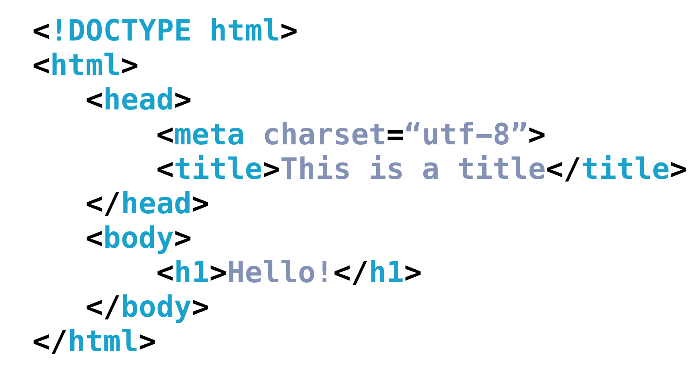

```
<!DOCTYPE html>
<html>
  <head>
    Meta information goes here!
  </head>
  <body>
    Content goes here!
  </body>  
</html>
```

- DOCTYPE : HTML 유형을 설명. 기술적으로 다른 유형이 있지만 &lt;!DOCTYPE html&gt;가 가장 흔하게 사용된다. 브라우저는 DOCTYPE에 지정된 대로 사이트를 렌더링한다. 현재의 HTML5에서는 표준 html로 선언해 사용할 수 있다. 오래된 사이트라면 렌더링 모드를 다른 것을 사용해야 할 수도 있다.    
- &lt;html&gt; : &lt;html&gt; ... &lt;/html&gt; 안에 들어있는 모든 내용은 HTML로 구문 분석해야한다는 것을 브라우저에 알린다.
- &lt;head&gt; : 제목과 같이 사이트에 대한 메타 정보를 설명하고 사이트에서 렌더링하고 올바르게 작동시키는 데 필요한 스크립트 및 스타일 시트에 대한 링크를 제공한다. 다음과 같은 내용들이 올 수 있다.    
  - 문서의 제목(브라우저 탭에 표시되는 텍스트) : &lt;title&gt; About Me&lt;/title&gt;
  - 관련된 CSS 파일 : &lt;link rel="stylesheet" type="text/css" href="style.css"&gt;
  - 관련된 JS 파일 : &lt;script src="animations.js"&gt;&lt;/script&gt;
  - 텍스트 인코딩 방법 : &lt;meta charset="utf-8"&gt;
  - 키워드, 저자, 라이센스 : &lt;meta name="description" content="This is what my website is all about!"&gt;
- &lt;body&gt; : 사용자에게 표시 될 사이트의 실제 콘텐츠를 설명한다.



꼭 이런 형식을 지키지 않아도 웹 브라우저가 유추해서 포함시키지만 명시적으로 적어주는 것이 좋다.
